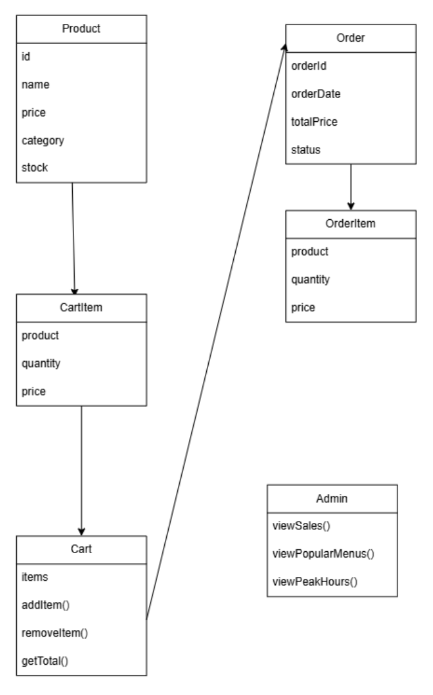
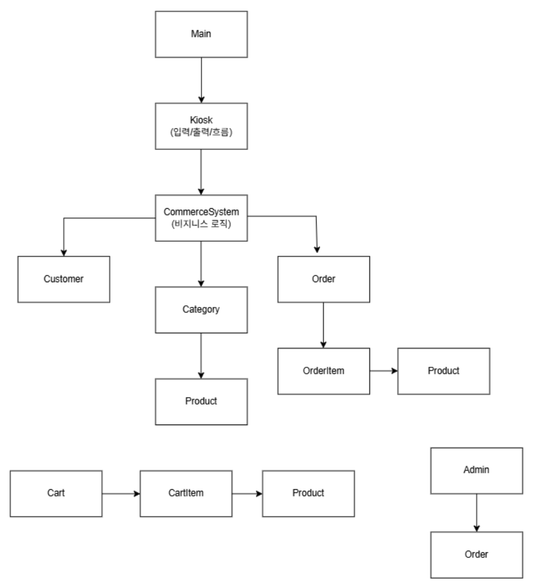

# 실시간 커머스 플랫폼

Java 기반 콘솔 커머스 플랫폼 구현 과제입니다.

## 프로젝트 소개

상품, 카테고리, 고객, 장바구니, 주문 및 재고 관리 기능을
객체 지향적으로 설계하고 구현했습니다.

## 설계
과제 구현에 앞서 상품, 카테고리, 고객, 주문, 재고 등의 관계를
파악하고 클래스 간 책임을 정의하기 위해 초기 설계 다이어그램을 작성했습니다.

### 초기 설계


## 주요 기능

### 기본 기능
- 상품 및 카테고리 관리
- 상품 조회
- 고객 정보 관리
- 장바구니 상품 추가
- 주문 처리
- 주문 완료 시 재고 차감

### 관리자 기능
- 관리자 인증
- 상품 추가
- 상품 수정
- 상품 삭제
- 전체 상품 현황 조회

## 프로젝트 구조

```text
CommerceBurger
├─ admin
│  └─ AdminSystem
├─ commerce
│  └─ CommerceSystem
├─ customer
│  └─ Kiosk
├─ domain
│  ├─ Product
│  ├─ Category
│  ├─ Customer
│  ├─ Cart
│  ├─ CartItem
│  ├─ Order
│  ├─ OrderItem
│  └─ OrderStatus
└─ Main
```

## 실행 예시
[버거킹]
1. 버거
2. 음료
3. 사이드
4. 세트
0. 종료

## 설계 및 리펙토링
기능 구현 과정에서 각 클래스의 책임을 분리하고,
Kiosk, CommerceSystem, domain 객체 간의 역할을 구분했습니다.
