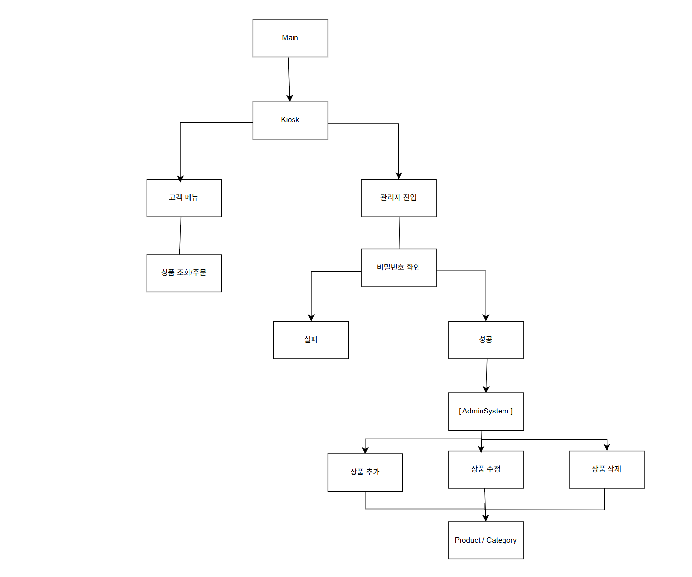

# 실시간 커머스 플랫폼

Java 기반 콘솔 커머스 플랫폼 구현 과제입니다.

## 프로젝트 소개

상품, 카테고리, 고객, 장바구니, 주문 및 재고 관리 기능을
객체 지향적으로 설계하고 구현했습니다.

## 설계
과제 구현에 앞서 상품, 카테고리, 고객, 주문, 재고 등의 관계를
파악하고 클래스 간 책임을 정의하기 위해 초기 설계 다이어그램을 작성했습니다.

### 초기 설계



## 주요 기능

### 기본 기능
- 상품 및 카테고리 관리
- 카테고리별 상품 조회
- 고객 정보 관리
- 장바구니 상품 추가 및 조회
- 장바구니 상품 삭제
- 주문 처리
- 주문 금액 계산
- 주문 완료 시 재고 차감
- 주문 완료 후 장바구니 초기화
- 재고 부족 상품 장바구니 추가 제한

### 관리자 기능
- 관리자 비밀번호 인증
- 비밀번호 3회 실패 처리
- 상품 추가
- 상품 수정
- 상품 삭제
- 중복 상품 등록 방지
- 카테고리별 상품 관리

### 고객 등급 및 할인

- `CustomerGrade` Enum을 통한 고객 등급 관리
- BRONZE / SILVER / GOLD / PLATINUM 등급
- 등급별 할인율 적용
- 주문 시 고객 등급에 따른 최종 결제 금액 계산

### Lambda & Stream

- 상품명 기반 상품 검색
- 가격 기준 상품 필터링
- 장바구니 상품 삭제
- `filter()`, `findFirst()` 등을 활용한 컬렉션 처리

## 기술 스택

- Java 17
- IntelliJ IDEA
- Git / GitHub
- 
## 프로젝트 구조


```text
CommerceBurger
├─ admin
│  └─ AdminSystem
├─ commerce
│  └─ CommerceSystem
├─ customer
│  └─ Kiosk
├─ domain
│  ├─ Product
│  ├─ Category
│  ├─ Customer
│  ├─ CustomerGrade
│  ├─ Cart
│  ├─ CartItem
│  ├─ Order
│  ├─ OrderItem
│  └─ OrderStatus
└─ Main
```

# 클래스별 역할

- Main: 프로그램 실행 및 초기 객체 구성
- Kiosk: 고객의 메뉴 선택 및 콘솔 입력 처리
- AdminSystem: 관리자 인증 및 상품 관리 기능 처리
- CommerceSystem: 장바구니 및 주문과 같은 커머스 흐름 처리
- Product: 상품 정보 및 재고 관리
- Category: 카테고리 및 상품 목록 관리
- Customer: 고객 정보 및 등급 관리
- CustomerGrade: 고객 등급 및 할인율 관리
- Cart: 장바구니 상품 관리
- CartItem: 장바구니 상품 및 수량 관리
- Order: 주문 상품 및 주문 금액 관리
- OrderItem: 주문 상품 및 수량 관리
- OrderStatus: 주문 상태 관리

## 실행 예시

[버거킹]
1. 버거
2. 음료
3. 사이드
4. 세트
5. 장바구니
6. 관리자
0. 종료

# 주문 흐름

상품 선택 > 장바구니 추가 > 장바구니 조회 > 주문 > 고객 등급 할인 적용 > 최종 결제 금액 계산 > 재고 차감 > 장바구니 초기화

# 관리자 흐름

관리자 인증 > 상품 추가 / 수정 / 삭제 > 카테고리의 상품 목록 관리

## 설계 및 리펙토링

- 기능 구현 과정에서 각 클래스의 책임을 분리하고, Kiosk, AdminSystem, CommerceSystem, domain 객체 간의 역할을 구분했습니다.
- 초기에는 하나의 클래스에서 여러 기능을 처리하던 구조를 기능과 책임에 따라 분리하여 관리하도록 리팩토링했습니다.
- 특히 관리자 상품 삭제와 고객 장바구니 상품 삭제를 별도의 책임으로 분리하여 상품 목록 관리와 장바구니 관리를 구분했습니다.
- 또한 고객 등급별 할인은 CustomerGrade Enum으로 관리하고, 상품 검색 및 가격 필터링과 장바구니 상품 삭제에는 Lambda & Stream을 적용했습니다.
